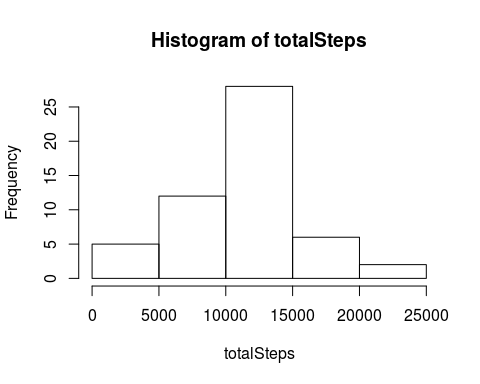
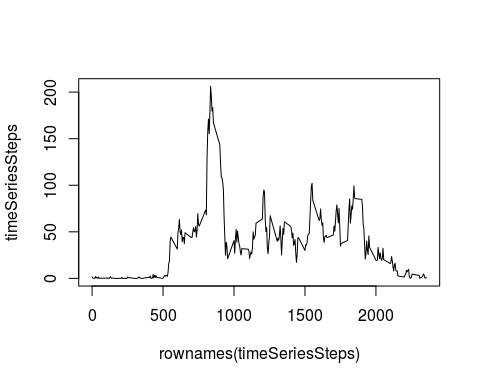
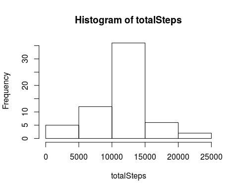
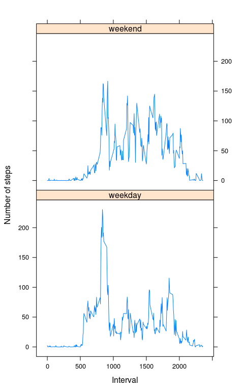

# Reproducible Research: Peer Assessment 1


## Loading and preprocessing the data

```r
# unzip the data
unzip("activity.zip")
# read data into R
activity <- read.csv("activity.csv", stringsAsFactors = F)
# change the "date" column to date class 
activity$date <- as.Date(activity$date)
```

## What is mean total number of steps taken per day?
1. Calculate the total number of steps taken per day:-

```r
suppressMessages(library(dplyr))
activity_df <- tbl_df(activity) #Create a data frame tbl

# find sum/total steps over each day
sumStepByDay <- activity_df %>%
  group_by(date) %>% summarise(totalSteps = sum(steps))
```

Here's the histogram of the above data

```r
with(sumStepByDay, hist(totalSteps))
```

 

2. Calculate the Mean and Median of the total number of steps taken per day:-

```r
options(digits=12) #control the number of digits to print
# 2a) Get Mean - Total number of Steps (taken per day)
meanTotals <- mean(sumStepByDay$totalSteps, na.rm = TRUE)
# 2b) Get Median - Total number of Steps (taken per day)
medianTotals <- median(sumStepByDay$totalSteps, na.rm = TRUE)
```

The Mean of Total number of Steps taken per day is :
1.076618867925\times 10^{4}
The Median of Total number of Steps taken per day is :
10765

## What is the average daily activity pattern?

Create a time-series by calculating the mean of steps grouped by 5-minute interval :-

```r
activity_df <- tbl_df(activity) # Create a data frame tbl
timeSeriesSteps <- with(activity_df, 
                tapply(steps, interval, mean, na.rm = TRUE))
```

Here's a plot for above data :-

```r
plot(x = rownames(timeSeriesSteps), y = timeSeriesSteps, type = "l")
```

 

Calculate the 5-minute interval, on average across all the days in the dataset, that contains the maximum number of steps :-

```r
maxInterval <- names(which.max(timeSeriesSteps))
maxValue <- timeSeriesSteps[which.max(timeSeriesSteps)]
```

835 5-minute interval contains the maximum number of steps at 206.169811320755

## Imputing missing values

Calculate number of rows with NA's

```r
suppressMessages(library(dplyr))
activity_df <- tbl_df(activity) # Create a data frame tbl.
numberOfRowNAs <- nrow(activity_df[!complete.cases(activity_df), ])
```

Total Number of Rows with NAs in our data is :- 2304

We are going to impute the NAs with means of the 5-minute intervals :-

```r
activityNAs <-  activity_df[!complete.cases(activity_df), ]
for(i in 1:numberOfRowNAs){
  activityNAs[i, "steps"] <- timeSeriesSteps[as.character(activityNAs[i, "interval"])]
}
```

Create a new dataset with above imputed data:

```r
## nonNA rows
activityNonNAs <-  activity_df[complete.cases(activity_df), ] 
# rbind with imputed NA dataset
activityImputed <- rbind(activityNAs, activityNonNAs)
```

Now, Calculate the total number of steps taken per day , on the new dataset :-

```r
suppressMessages(library(dplyr))
activityIm_df <- tbl_df(activityImputed) #Create a data frame tbl
# find sum/total steps over each day
imputedSumStepsByDay <- activityIm_df %>%
  group_by(date) %>% summarise(totalSteps = sum(steps))
```

Create a histogram with above data:-

```r
with(imputedSumStepsByDay, hist(totalSteps))
```

 

What is the impact of imputing missing data on the estimates of the total daily number of steps?
Calculate Mean and Median on the imputed data  :-

```r
options(digits=12)
# Mean - Total number of Steps (taken per day)
meanImputed <- mean(imputedSumStepsByDay$totalSteps, na.rm = TRUE)
# Median - Total number of Steps (taken per day)
medianImputed <- median(imputedSumStepsByDay$totalSteps, na.rm = TRUE)

#Percentage change on Mean
meanChange <- ((meanTotals - meanImputed) *100)/ meanTotals

#Percentage change on Median
medianChange <- ((medianTotals - medianImputed) *100)/ medianTotals
```

The Mean of Total number of Steps taken per day is (on imputed Data) :
1.076618867925\times 10^{4}
The Median of Total number of Steps taken per day is (on imputed Data) : 1.076618867925\times 10^{4}

Percentage change on Mean (from non-imputed data) is
:- 0 %
Percentage change on Median (from non-imputed data) is
:- -0.011042073807 %

## Are there differences in activity patterns between weekdays and weekends?

Using the imputed data.frame, Create a new factor variable in the  dataset with two levels – “weekday” and “weekend”

```r
dayOfWeek <- sapply(activityIm_df$date, weekdays) #identify day of Week
weekdayTF <- sapply(dayOfWeek, 
                    function(x) 
                     if(x %in% c("Saturday", "Sunday")) "weekend" 
                     else "weekday") # identify day of Week as "weekday" or "weekend"
activityIm_df$dayType <- as.factor(weekdayTF) # create a factor variable
```

Create a timeseries grouped on interval and dayType for steps :-

```r
intervalDayType <- aggregate(steps ~ interval + dayType, 
                                    data = activityIm_df, mean)
```

Here's a plot for the above data:-

```r
library(lattice)
xyplot(steps ~ interval | dayType, intervalDayType, 
       type = "l", layout = c(1, 2), 
       xlab = "Interval", ylab = "Number of steps")
```

 
